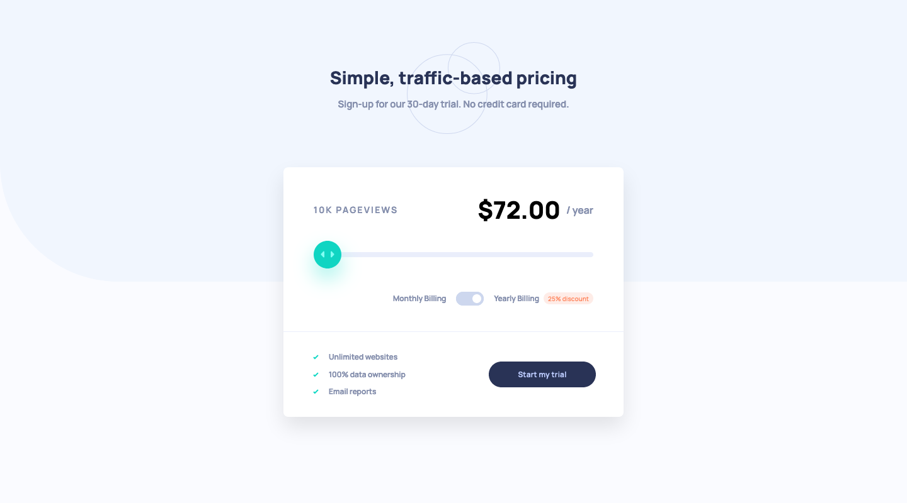

# Frontend Mentor - Interactive Pricing Component Solution

This is a solution to the [Interactive Pricing Component challenge on Frontend Mentor](https://www.frontendmentor.io/challenges/interactive-pricing-component-t0m8PIyY8). Frontend Mentor challenges help you improve your coding skills by building realistic projects.

## The challenge

Users should be able to:

- View the optimal layout for the app depending on their device's screen size
- See hover states for all interactive elements on the page
- Use the slider and toggle to see prices for different page view numbers

## Screenshot

### Mobile

### Desktop

## Built with

- Semantic HTML5 markup
- CSS custom properties
- Flexbox
- Mobile-first workflow
- JavaScript / jQuery

## What I learned

I really enjoyed this Frontend Mentor challenge. I don't often get to use the 'range' input in projects so I had to do a little bit of research into styling that element.

Now that I'm using the VoiceOver screen reader when making my projects, I am uncovering many accessibility issues that I would not have been aware of otherwise. I make use of `aria-hidden="true"` so that the screen reader ignores unnecessary elements, and `aria-live="polite"` to get the screen reader to read out any elements that have their content updated.

I learned about the `aria-valuenow` attribute which updates the current value of the slider when the user changes the value. Also, the `aria-valuetext` attribute which reads out (on VoiceOver at least) a custom value, in this case the 'page views' figure, rather than the range values which are arbitrary.

My JavaScript and jQuery knowledge continues to improve. I feel as if my code is particularly concise in this project and I didn't get stuck on anything for too long.

## Continued development

This was a 'junior' difficutly challenge and therefore it didn't push me all too much, but it was very fun. I will pick an 'intermediate' difficulty challenge next and see how I get on. I've also started a course on Udemy which will hopefully help me with the more difficult projects.